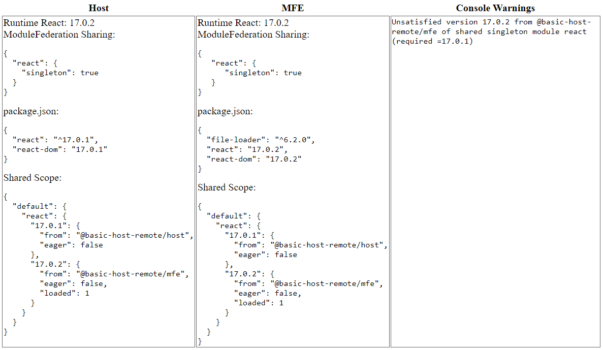

# Module Federation Shared Dependency Playground

This example lets you easily change the settings of shared dependencies to see the impact and which are actually loaded and used.

Based on the @basic-host-remote example repo.

